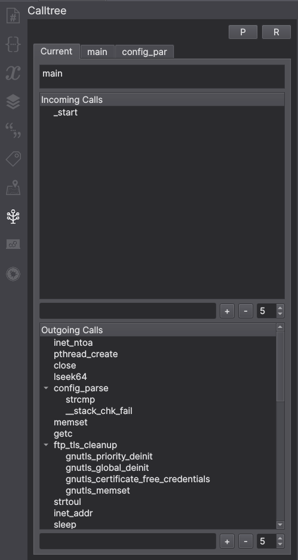
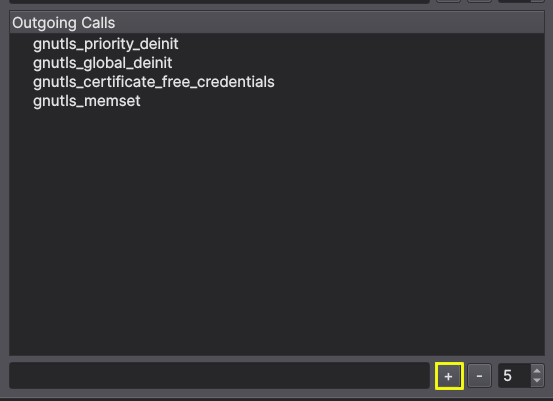
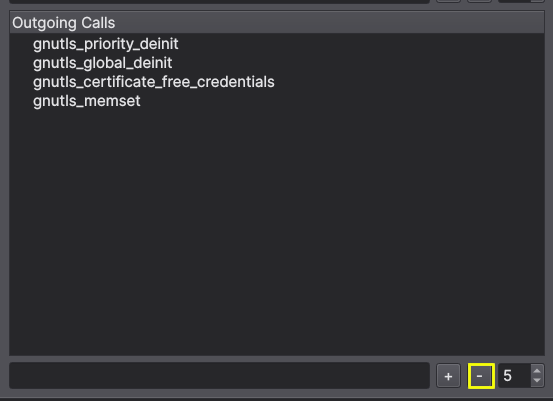
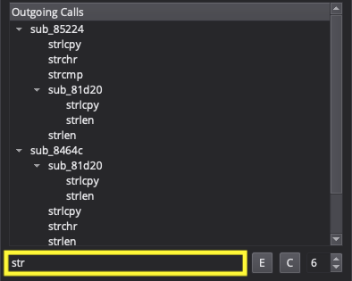
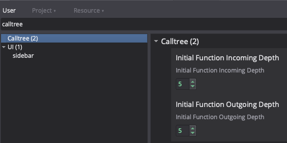
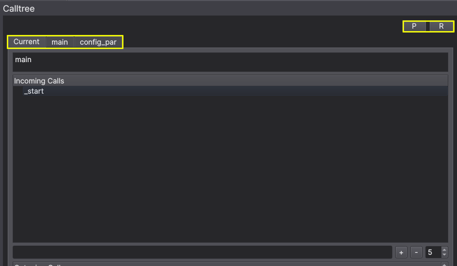
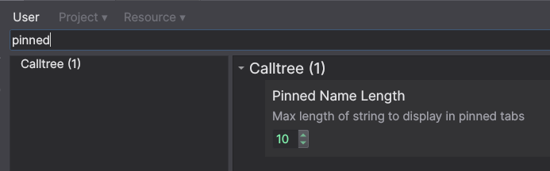

# Calltree

Author: **Eric Biazo**

Calltree generator for function

## Description:

Generates call tree. Alternative view for callgraph.

## Releases

* 2.1 -- Bug Fix
* 2.0 -- Multiview Support
* 1.2 -- Bug Fixes
* 1.1 -- Refactoring
* 1.0 -- Public Release
* 0.0 -- Beta Release

## Minimum Version

This plugin requires the following minimum version of Binary Ninja:

 * 2966

## License

This plugin is released under an [MIT license](./LICENSE).

## Caution

When working with really big binaries with alot of xrefs, you would want to change recursive depth to smaller number or else Binary Ninja might hang.
## Description

Calltree is a plugin that generates call tree for a function. It is an alternative view for callgraph. It is a multiview plugin, so you can have multiple calltree views open at the same time.

### Default View

### Expand and Collapse tree

**Expand**

**Collapse**

**Search**

### Recursion Depth

**Show Only Root Level**

**Default Recursion Depth in Setting**

### Pinning and Removing Calltree View

**Pinning Calltree View**

**Pinned Calltree Name Max Length**

## Contributors

Thanks everyone that have contributed to calltree!

* galenbwill
* droogie
* bambu
* crimsonskylark
