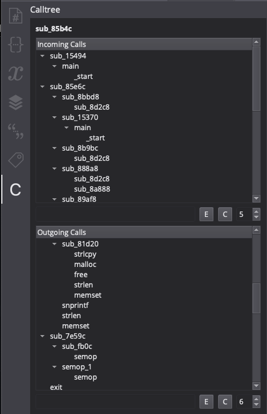
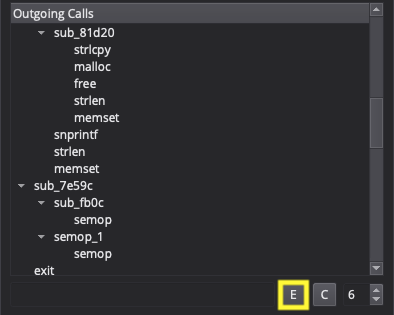
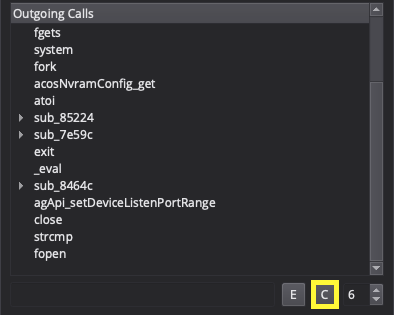

# Calltree

Author: **Eric Biazo**

Calltree generator for function

## Description:

Generates call tree

## Releases

* v0.0 -- Beta release

## Minimum Version

This plugin requires the following minimum version of Binary Ninja:

 * 2966

## License

This plugin is released under an [MIT license](./LICENSE).

## Caution

When working with really big binaries with alot of xrefs, you would want to change recursive depth to smaller number or else Binary Ninja might hang.
## Description

### Expand and Collapse tree

**Expand**

**Collapse**

**Search**

**Recursion Depth**

**Show Only Root Level**

**Default Recursion Depth in Setting**

## Future Work:

- [ ] Ability to expand selected function
- [x] Ability to expand all functions
- [x] Setting and viewing depth of function recursion
- [x] Move widget to side bar
- [ ] Generating graph on current call tree
- [ ] Refactor Code
- [x] Documentation
