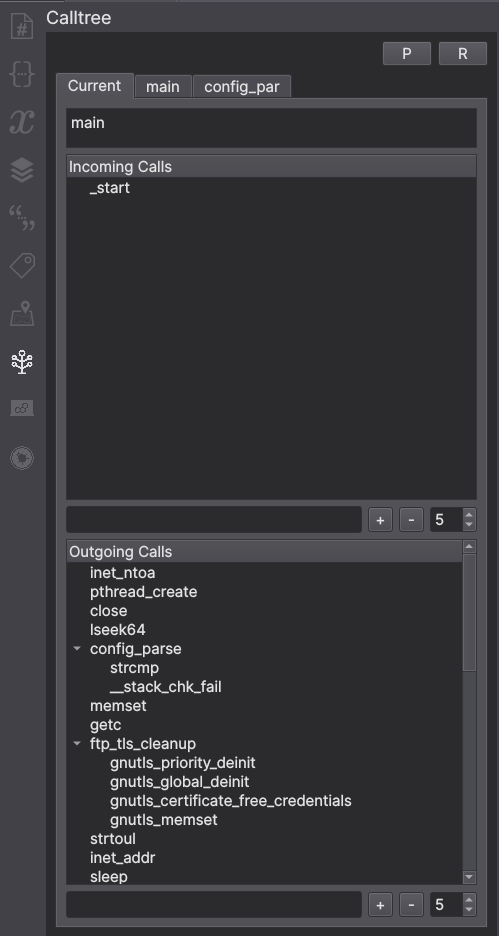
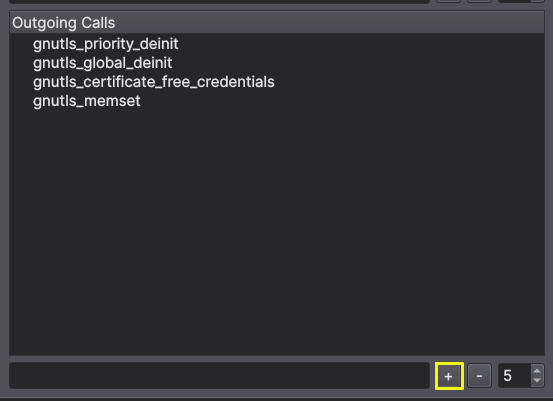
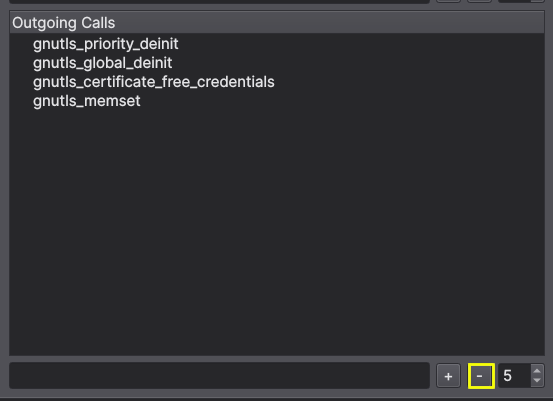
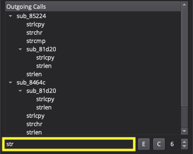
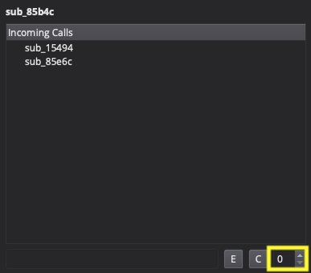
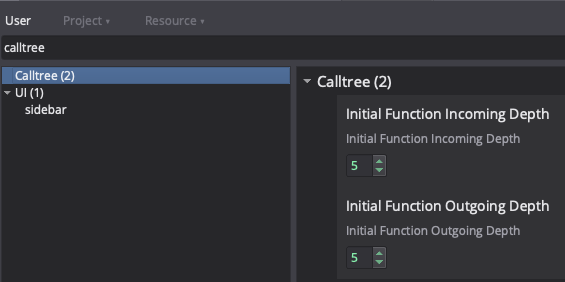
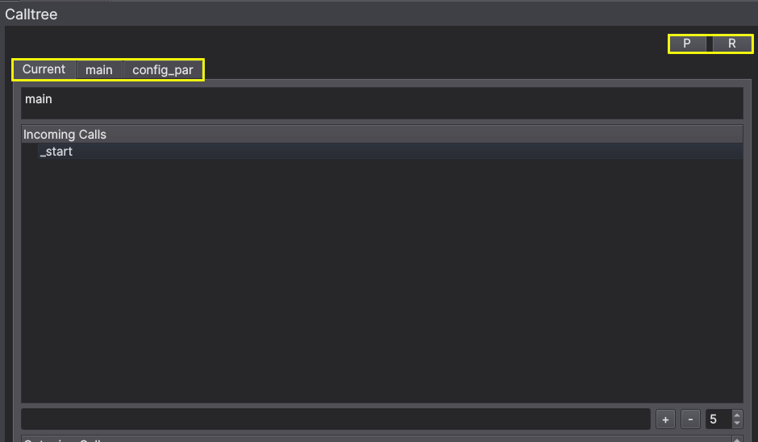
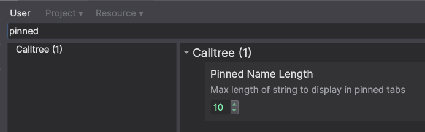

# Calltree

Author: **Eric Biazo**

Calltree and Callgraph generator for function

## Description:

Generates calltree and callgraph for a function.

## Releases

* 3.0 -- Graph-backed call data + Python API (`networkx`), optimization, better search, big-binary support, call-graph export, recursion markers, colored/clickable graph nodes.
* 2.1 -- Bug Fix
* 2.0 -- Multiview Support
* 1.2 -- Bug Fixes
* 1.1 -- Refactoring
* 1.0 -- Public Release
* 0.0 -- Beta Release

## Minimum Version

This plugin requires the following minimum version of Binary Ninja:

 * 2966

## License

This plugin is released under an [MIT license](./LICENSE).

## Caution

When working with really big binaries with alot of xrefs, you would want to change recursive depth to smaller number or else Binary Ninja might hang.
## Description

Calltree is a plugin that generates call tree for a function. It is an alternative view for callgraph. It is a multiview plugin, so you can have multiple calltree views open at the same time.

## Features

### Call trees

- **Incoming Calls** (callers) and **Outgoing Calls** (callees) panes, each rooted on
  the current function and updated as you navigate.
- **Lazy, bounded rendering** — trees load on demand and auto-expand only to a
  configurable depth, so even large binaries stay responsive; deeper levels load as you
  expand them.
- **Recursion marker** — a call back into an ancestor (e.g. `_ping → _pong → _ping`) is
  shown as a leaf with a recursion icon, so cycles are obvious and never expand forever.
- **Clickable "… N more"** — when a function has more children than the display cap, a
  "… N more" row loads all the remaining children on click.
- **Manual deep-expand** — clicking a node's expand arrow drills one level deeper even
  past the auto-expand depth, so you can follow a single path arbitrarily deep without
  expanding the whole tree.
- **Horizontal scrolling** with full, un-elided names.

### Per-pane controls

Each pane has a **header row** and, below the tree, a **search row**:

- **Header row** — `[<direction> Calls ········· [depth] [+] [−]]`: the pane label plus
  the **depth** spinbox (how many levels auto-expand on navigation) and the **+**
  expand-all / **−** collapse buttons (`+` reveals the entire reachable subtree, `−`
  collapses it).
- **Search row** — `[search box ×] [x of y] [↑] [↓]`: type a name and press **Enter** to
  search the **entire** call subtree by name (ignoring depth / node caps). The tree is
  pruned to just the paths leading to matches, each branch **ending at its match** (matches
  in **bold**). The built-in **×** clear button (or emptying the box) drops the search and
  restores the normal tree. The `x of y` counter (shown only while searching) and the
  **↑ / ↓** buttons cycle through matches, centering each; **"No matches"** is shown when
  nothing matches.

Panes also show explicit placeholders: **"No functions"** (no callers/callees in that
direction), **"Depth is 0"** (depth set to 0), and **"Loading…"** while a large expand-all
walk runs in the background.

### Call graph export

- The **graph** button (on the current-function row, arranged as `[graph] | [pin]
  [close]`) opens a Binary Ninja flow graph of exactly what the two panes currently show.
- Nodes are **color-coded** — root (orange), incoming callers (blue), outgoing callees
  (green) — and **clickable**: double-click a node to navigate to that function. To
  narrow the graph, search or expand the trees first, then open it.

### Navigation & tabs

- **Single click** previews (navigates the disassembly without re-rooting the Current
  tab); **double click** commits (navigates *and* re-roots the Current tab).
- **Pin** the current call tree into a new tab to keep a snapshot while you keep
  navigating; remove a pinned tab with the close button.

### Settings

- Initial incoming/outgoing depth, max auto-expanded nodes, and pinned-tab name length
  are all configurable under the `Calltree` settings group.

## Screenshots

### Default View



### Expand and Collapse tree

**Expand**



**Collapse**



**Search**



### Recursion Depth

**Show Only Root Level**



**Default Recursion Depth in Setting**



### Pinning and Removing Calltree View

**Pinning Calltree View**



**Pinned Calltree Name Max Length**




## Python API

As of `3.0`, the caller/callee relationships are backed by a real graph
(`networkx.DiGraph`) that is decoupled from the UI, so you can query the call
graph programmatically from the Binary Ninja Python console. Nodes are function
start addresses and every edge points from a **caller** to a **callee**.

The graph is expanded lazily around a function and cached per `BinaryView`, so it
stays cheap even on large binaries.

```python
from calltree import get_call_graph

# `bv` is the current BinaryView. `cg` is cached per BinaryView.
cg = get_call_graph(bv)

main = bv.get_functions_by_name("main")[0]

# Grow the graph around a function (direction: "callees", "callers" or "both").
cg.expand(main, direction="both", max_depth=6)

# --- Queries ---
cg.callees(main)          # functions main calls
cg.callers("malloc")      # functions that call malloc (accepts Function/addr/name)

# --- Search (substring by default; regex + mangled-name options available) ---
cg.search("alloc")
cg.search(r"^str.*cpy$", regex=True)

# --- Path finding ---
cg.reaches("main", "system")          # bool: can main reach system?
cg.shortest_path("main", "system")    # [Function, ...]
for path in cg.all_paths("main", "system", cutoff=8):
    print([f.name for f in path])

# --- Traversal ---
for func in cg.bfs(main, direction="callees", max_depth=3):
    print(func.name)

# --- Export ---
cg.to_networkx()   # the underlying networkx.DiGraph
cg.to_dict()       # serializable {"nodes": [...], "edges": [...]}
cg.to_edge_list()  # [(caller_addr, callee_addr), ...]
```

This plugin depends on [`networkx`](https://networkx.org/). Installing via the
Binary Ninja plugin manager installs it automatically from `requirements.txt`; for
manual installs, use the `Install python3 module` command palette action or
`pip install networkx` against Binary Ninja's interpreter.

### Manual / development checkouts

If you cloned this repo straight into your Binary Ninja `plugins/` folder (instead
of installing through the plugin manager), `requirements.txt` is **not** installed
automatically, so you must add `networkx` to Binary Ninja's Python yourself:

* **Easiest:** command palette (`CTRL/CMD-P`) → `Install python3 module` → enter
  `networkx`.
* **From a shell**, install into Binary Ninja's user `pythonXY` folder, e.g. on
  macOS with the bundled Python 3.10:

  ```bash
  pip3 install --target \
    "$HOME/Library/Application Support/Binary Ninja/python310" networkx
  ```

  (Linux uses `~/.binaryninja/pythonXY`; Windows uses
  `%APPDATA%\Binary Ninja\pythonXY`.)

**Restart Binary Ninja** afterwards — the plugin imports `networkx` at load time,
so a running instance won't pick it up until relaunched. Without it, the call
trees render empty and an error is logged.

## Architecture

For a detailed design overview — modules, the call-graph data model, the threading
model, lazy rendering, search, dirty-tracking, and key control flows — see
[`doc/architecture.md`](doc/architecture.md).

## Contributors

Thanks everyone that have contributed to calltree!

* galenbwill
* droogie
* bambu
* crimsonskylark
* SilentVoid13
